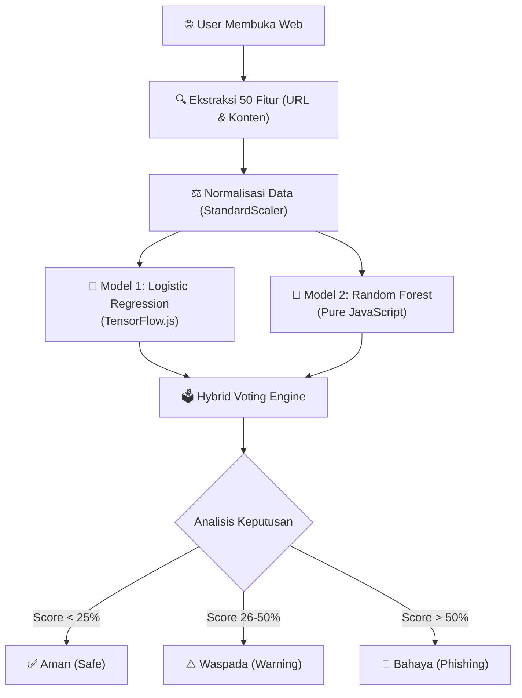

# GuardNet V.01 🛡️
### AI-Powered Hybrid Phishing Detection

GuardNet adalah ekstensi browser canggih yang menggabungkan kekuatan **Logistic Regression** dan **Random Forest** untuk mendeteksi situs phishing secara real-time. Berjalan sepenuhnya di sisi klien (offline), GuardNet menjaga privasi Anda sambil memberikan perlindungan tingkat militer terhadap ancaman siber.

---

## 🌟 Fitur Unggulan

| Fitur | Deskripsi |
|-------|-----------|
| **🧠 Hybrid AI Engine** | Menggabungkan *Logistic Regression* (TensorFlow.js) dan *Random Forest* untuk akurasi tinggi & minim False Positive. |
| **⚡ Real-time Scanning** | Analisis dalam milidetik (rata-rata <100ms) tanpa mengirim data ke server eksternal. |
| **🔍 50+ Fitur Analisis** | Memeriksa URL, konten halaman, struktur DOM, dan pola penipuan tersembunyi. |
| **🛡️ Privacy First** | Data browsing Anda **TIDAK PERNAH** meninggalkan laptop Anda. Semua proses terjadi lokal. |
| **🔌 Offline Ready** | Tetap terlindungi bahkan saat koneksi internet tidak stabil. |

---

## 🛠️ Arsitektur Sistem (Hybrid Logic)

GuardNet V.01 menggunakan pendekatan dua tahap yang unik untuk menentukan keamanan sebuah website.



### Detail Teknis
Untuk detail implementasi teknis yang mendalam, silakan baca dokumen perencanaan kami:
👉 **[Lihat Rencana Implementasi Hybrid (Detail)](https://github.com/soekanta/GuardNet-Version-0.1/blob/main/catatan/implementation_plan_hybrid.md)**

---

## 👥 Tim Pengembang

Proyek ini dikembangkan dengan dedikasi tinggi oleh:

*   **Wahyu Soekanta Ginting** 
*   **Katrin Wijaya** 
*   **Nuragustyani** 

---

## 📦 Panduan Instalasi (Development)

1.  **Clone Repository**
    ```bash
    git clone https://github.com/soekanta/GuardNet-Version-0.1.git
    ```
2.  **Load di Chrome**
    *   Buka `chrome://extensions/`
    *   Aktifkan "Developer mode" (pojok kanan atas).
    *   Klik "Load unpacked" dan pilih folder project ini.
3.  **Selesai!** GuardNet siap melindungi Anda.

---

## 🧪 Pengujian (Testing)

Anda dapat menguji keandalan GuardNet menggunakan URL berikut:

| Kategori | Contoh URL | Ekspektasi |
|----------|------------|------------|
| **✅ Aman** | `https://www.google.com` | Hijau (0-25%) |
| **✅ Aman** | `https://www.kaskus.co.id` | Hijau (0-25%) |
| **⚠️ Waspada** | `https://www.netgear.com` | Kuning (26-50%) |
| **🚫 Phishing** | `http://paypal.idkit.co/` | Merah (>51%) |

---

> *Project ini dibuat sebagai bagian dari penelitian keamanan siber dan kecerdasan buatan.*
