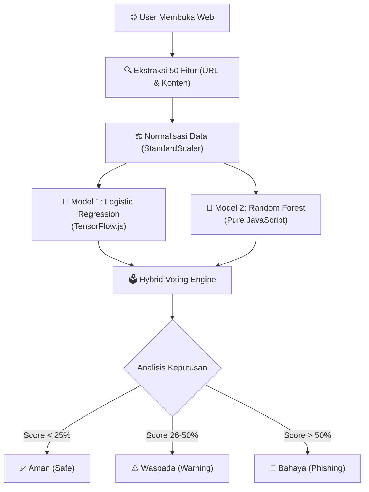

# GuardNet V.01 🛡️
### AI-Powered Hybrid Phishing Detection

GuardNet adalah ekstensi browser canggih yang menggabungkan kekuatan **Logistic Regression** dan **Random Forest** untuk mendeteksi situs phishing secara real-time. Berjalan sepenuhnya di sisi klien (offline), GuardNet menjaga privasi Anda sambil memberikan perlindungan tingkat militer terhadap ancaman siber.

---

## 🌟 Fitur Unggulan

| Fitur | Deskripsi |
|-------|-----------|
| **🧠 Hybrid AI Engine** | Menggabungkan *Logistic Regression* (TensorFlow.js) dan *Random Forest* untuk akurasi tinggi & minim False Positive. |
| **⚡ Real-time Scanning** | Analisis dalam milidetik (rata-rata <100ms) tanpa mengirim data ke server eksternal. |
| **🔍 50+ Fitur Analisis** | Memeriksa URL, konten halaman, struktur DOM, dan pola penipuan tersembunyi. |
| **🛡️ Privacy First** | Data browsing Anda **TIDAK PERNAH** meninggalkan laptop Anda. Semua proses terjadi lokal. |
| **🔌 Offline Ready** | Tetap terlindungi bahkan saat koneksi internet tidak stabil. |

---

## 🛠️ Arsitektur Sistem (Hybrid Logic)

GuardNet V.01 menggunakan pendekatan dua tahap yang unik untuk menentukan keamanan sebuah website.



### Detail Teknis
Untuk detail implementasi teknis yang mendalam, silakan baca dokumen perencanaan kami:
👉 **[Lihat Rencana Implementasi Hybrid (Detail)](https://github.com/soekanta/GuardNet-Version-0.1/blob/main/catatan/implementation_plan_hybrid.md)**

---

## 👥 Tim Pengembang

Proyek ini dikembangkan dengan dedikasi tinggi oleh:

*   **Wahyu Soekanta Ginting** 
*   **Katrin Wijaya** 
*   **Nuragustyani** 

---

## 📦 Panduan Instalasi (Development)

### Langkah 1: Install Git (Jika Belum Ada)

Anda bisa menggunakan salah satu dari opsi berikut:

**Opsi A: Git for Windows** (Recommended)
- Download dari [git-scm.com](https://git-scm.com/download/win)
- Install dengan pengaturan default
- Setelah install, Anda bisa gunakan **Git Bash**, **Git CMD**, atau **PowerShell**

**Opsi B: GitHub Desktop** (Untuk Pemula)
- Download dari [desktop.github.com](https://desktop.github.com/)
- Interface grafis yang lebih mudah digunakan
- Tidak perlu mengetik command

### Langkah 2: Clone Repository

**Menggunakan Git Bash / Git CMD / PowerShell:**
```bash
git clone https://github.com/soekanta/GuardNet-Version-0.1.git
```

**Menggunakan GitHub Desktop:**
1. Klik `File` → `Clone Repository`
2. Pilih tab `URL`
3. Paste: `https://github.com/soekanta/GuardNet-Version-0.1.git`
4. Pilih lokasi penyimpanan
5. Klik `Clone`

**Hasil Setelah Clone:**
Anda akan mendapatkan folder `GuardNet-Version-0.1` yang berisi:
```
GuardNet-Version-0.1/
├── manifest.json          # Konfigurasi extension
├── background.js          # Service worker
├── scan.html & scan.js    # UI scanning
├── sandbox.js             # AI engine
├── random_forest.js       # Random Forest model
├── models/                # Model AI (TensorFlow.js & RF)
├── icons/                 # Icon extension
└── catatan/               # Dokumentasi
```

### Langkah 3: Load Extension di Chrome

1. Buka Chrome dan ketik di address bar: `chrome://extensions/`
2. **Aktifkan "Developer mode"** (toggle di pojok kanan atas)
3. Klik tombol **"Load unpacked"**
4. Pilih folder `GuardNet-Version-0.1` yang baru saja di-clone
5. **Selesai!** Icon GuardNet 🛡️ akan muncul di toolbar Chrome

### Langkah 4: Verifikasi Instalasi

- Klik icon GuardNet di toolbar
- Buka website apapun (contoh: `google.com`)
- Klik tombol **"Scan URL"**
- Anda akan melihat hasil analisis dengan status warna:
  - 🟢 **Hijau** = Aman (0-25%)
  - 🟡 **Kuning** = Waspada (26-50%)
  - 🔴 **Merah** = Bahaya (>50%)

---

## 🧪 Pengujian (Testing)

Anda dapat menguji keandalan GuardNet menggunakan URL berikut:

| Kategori | Contoh URL | Ekspektasi |
|----------|------------|------------|
| **✅ Aman** | `https://www.google.com` | Hijau (0-25%) |
| **✅ Aman** | `https://www.kaskus.co.id` | Hijau (0-25%) |
| **⚠️ Waspada** | `https://www.netgear.com` | Kuning (26-50%) |
| **🚫 Phishing** | `http://paypal.idkit.co/` | Merah (>51%) |

---

> *Project ini dibuat sebagai bagian dari penelitian keamanan siber dan kecerdasan buatan.*
