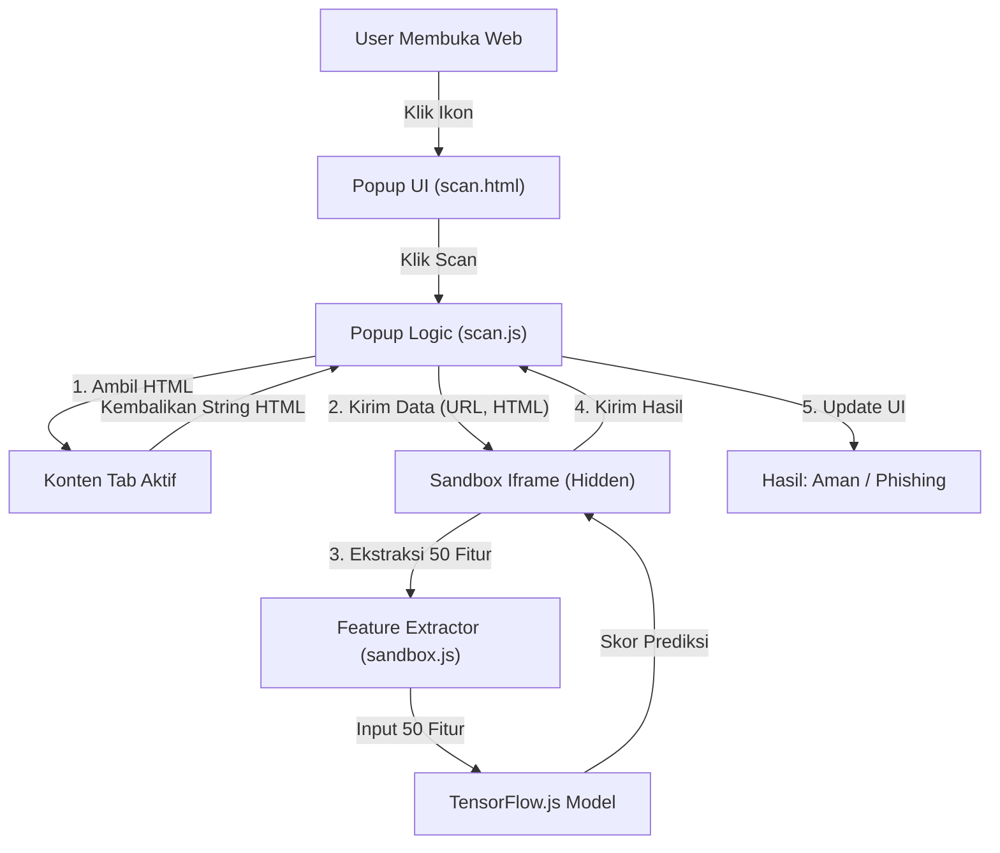

# GuardNet V.01 🛡️
### AI-Powered Phishing Detection Extension

GuardNet adalah ekstensi Google Chrome cerdas yang dirancang untuk mendeteksi situs web phishing secara *real-time* langsung dari browser Anda. Menggunakan model *Machine Learning* TensorFlow.js yang berjalan sepenuhnya secara offline (di sisi klien), GuardNet menjaga privasi data Anda sekaligus memberikan perlindungan maksimal dari ancaman siber.

---

## 👥 Tim Pengembang

Proyek ini dipersembahkan oleh:

*   **Wahyu Soekanta Ginting**
*   **Katrin Wijaya**
*   **Nuragustyani**

---

## 🚀 Fitur Utama

*   **⚡ Deteksi Cepat & Akurat**: Menganalisis URL dan konten halaman dalam hitungan detik menggunakan Neural Network.
*   **🔒 Privasi Terjamin**: Arsitektur *client-side only*. Data browsing Anda tidak pernah dikirim ke server/cloud eksternal. Model AI berjalan langsung di browser Anda.
*   **🧠 Analisis Mendalam (50 Fitur)**: Tidak hanya mengecek *blacklist*, GuardNet menganalisis **50 karakteristik** website termasuk:
    *   Pola URL (panjang, karakter aneh, IP address).
    *   Konten Halaman (jumlah iframe, form login tersembunyi, redirection).
    *   Elemen Teknis (HTTPS status, favicon, script eksternal).
*   **🌐 Dukungan Offline**: Model berjalan lokal tanpa internet, namun ekstraksi fitur memerlukan akses ke tab aktif.

## ⚠️ Batasan & Kelemahan Sistem (Known Limitations)

1.  **Masalah CORS (Cross-Origin Resource Sharing)**:
    *   **Apa itu CORS?**: Mekanisme keamanan di browser yang melarang sebuah website (atau ekstensi) mengambil data dari website lain tanpa izin.
    *   **Dampaknya**: Beberapa website ketat (seperti `uni-mainz.de`) memblokir GuardNet untuk membaca konten HTML-nya. Akibatnya, GuardNet melihat halaman tersebut "kosong" (fitur = 0), yang oleh model dianggap sebagai ciri-ciri website phising/rusak, sehingga muncul **False Positive 100% (Merah)**.

2.  **Bias Dataset**:
    Model dilatih dominan dengan data domain global (.com, .net). Domain lokal spesifik (seperti `.co.id`) mungkin kadang terdeteksi sebagai anomali jika jarang ditemukan di data latih.

---

## 🛠️ Arsitektur Teknis

GuardNet dibangun menggunakan standar web modern (**Manifest V3**) dan teknik **Sandboxing** untuk menjembatani keamanan Chrome dengan fleksibilitas TensorFlow.js.

## 📦 Panduan Instalasi

1.  **Download Source Code**: Clone repository ini atau unduh sebagai ZIP dan ekstrak.
2.  **Buka Manajemen Ekstensi**:
    *   Buka browser Google Chrome.
    *   Ketik `chrome://extensions/` di address bar.
3.  **Aktifkan Developer Mode**:
    *   Klik tombol toggle **"Developer mode"** di pojok kanan atas halaman.
4.  **Load Extension**:
    *   Klik tombol **"Load unpacked"**.
    *   Pilih folder `GuardNet` yang telah di-ekstrak.
5.  **Selesai!** Ikon GuardNet akan muncul di toolbar browser Anda.

## 🧪 Contoh URL untuk Testing

Berikut adalah beberapa URL yang bisa Anda gunakan untuk menguji kinerja GuardNet.
*(Catatan: Sebagian URL phishing mungkin sudah mati/offline karena umur dataset)*

### ✅ Situs Aman (Safe)
*   `https://www.google.com`
*   `https://www.kaskus.co.id`

### ❌ Situs Phishing (Bahaya)
*Diambil dari dataset PhiUSIIL:*
*   `http://paypal.idkit.co/` (Target: PayPal)
*   `http://www.paypal-update.grasssnake.fastom.pl`
*   `http://ypxn-xn--80aaahorunoimsf3p.xn--p1ai/fix-account/`

### ⚠️ Edge Cases / Warning (Kuning)
*   `https://www.netgear.com` (Terdeteksi **Warning/Kuning**).
*   `https://www.kompas.id` (Berita Premium -> **Warning/Kuning**).
*   `https://www.uni-mainz.de` (Situs Universitas Jerman -> **False Positive (100%)** karena blokir CORS).
*   `https://www.kompasiana.com` (Platform Blog Lokal -> **False Positive (Merah)** mungkin karena konten user/CORS).

> **💡 Note Analisis: Kenapa Kaskus Hijau tapi Kompas.id Kuning?**
> *   **Kaskus (Aman)**: Memiliki struktur forum yang standar dan terbuka. Konten teks mendominasi dan mudah dibaca oleh ekstraktor fitur GuardNet, sehingga skor legitimasinya tinggi.
> *   **Kompas.id (Waspada)**: Merupakan situs berita premium yang menggunakan *Paywall* (tembok langganan) dan script kompleks untuk membatasi akses. Struktur ini kadang terdeteksi sebagai "anomali" atau "konten tersembunyi" oleh model login-trap detector, sehingga menaikkan skor risiko ke level **Warning**.

---

## 💻 Cara Penggunaan

1.  **Instal & Lupakan**: Pastikan GuardNet sudah terpasang.
2.  **Browsing Normal**: Kunjungi situs web apa saja seperti biasa.
3.  **Proteksi Otomatis**: Jika situs tersebut belum masuk *Whitelist*, GuardNet akan secara **otomatis mencegat (intercept)** dan mengalihkannya ke halaman scanning.
4.  **Lihat Hasil**:
    *   **✅ Aman**: Klik tombol **"Lanjutkan ke Website"**.
    *   **⚠️ Waspada / ❌ Phishing**: Sebaiknya **"Kembali"** untuk keamanan Anda.

*Tidak perlu mengklik ikon ekstensi sama sekali. GuardNet bekerja diam-diam di latar belakang.*

---
*Dikembangkan dengan ❤️ untuk keamanan internet yang lebih baik.*
