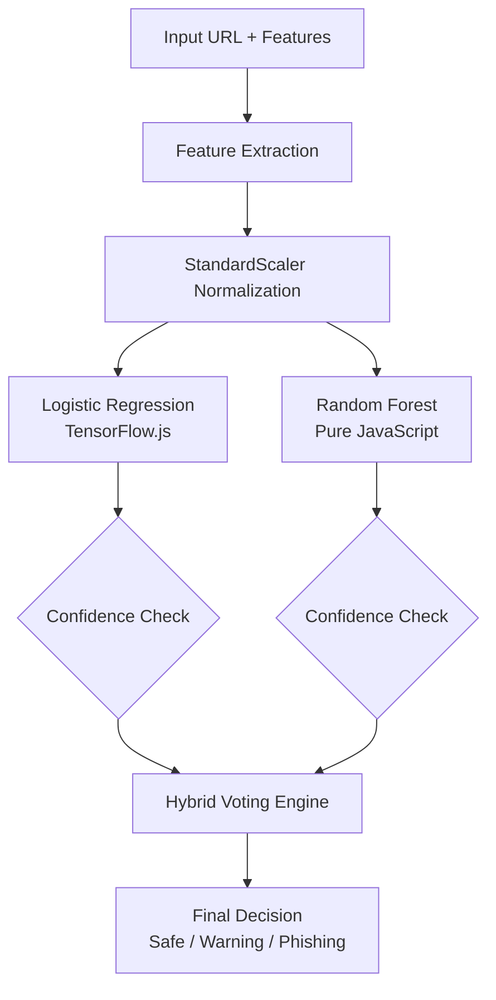

# Hybrid Phishing Detection: Logistic Regression + Random Forest

## Background & Goal

GuardNet saat ini menggunakan model **Logistic Regression** (dikemas dalam TensorFlow.js sebagai Single-Layer Neural Network dengan sigmoid activation) untuk mendeteksi phishing URL. Model ini sudah berjalan sepenuhnya di sisi klien dengan 50 fitur yang diekstrak dari URL dan konten halaman.

**Tujuan**: Menambahkan model **Random Forest** sebagai pengklasifikasi pendukung untuk membentuk sistem **hybrid** yang mengurangi false positive dan false negative.

---

## Arsitektur Hybrid yang Diusulkan



---

## Proposed Changes

### Component 1: Random Forest Implementation

#### **[NEW]** random_forest.js

Implementasi Random Forest murni JavaScript tanpa library eksternal:

```javascript
// Struktur Decision Tree Node
{
  "featureIndex": 5,     // Index fitur untuk split
  "threshold": 0.5,      // Nilai threshold untuk split
  "left": {...},         // Node kiri (≤ threshold)
  "right": {...},        // Node kanan (> threshold)
  "value": [0.8, 0.2]    // Probabilitas [legit, phishing] untuk leaf node
}
```

**Fitur utama:**
- Traversal decision tree dengan `O(log n)` complexity
- Support untuk multiple trees dengan majority voting
- Output probabilitas dengan confidence score
- Ukuran file target: < 50KB

---

#### **[NEW]** models/rf_model.json

File JSON berisi struktur Random Forest:

```json
{
  "n_estimators": 10,
  "max_depth": 5,
  "feature_names": ["URLLength", "DomainLength", ...],
  "trees": [
    {
      "featureIndex": 0,
      "threshold": 45.5,
      "left": { ... },
      "right": { ... }
    }
  ]
}
```

**Rekomendasi hyperparameter untuk browser:**

| Parameter | Nilai | Alasan |
|-----------|-------|--------|
| `n_estimators` | 10-20 | Balance antara akurasi dan ukuran file |
| `max_depth` | 4-6 | Mencegah overfitting, menjaga ukuran kecil |
| `min_samples_split` | 10 | Generalisasi lebih baik |

---

### Component 2: Hybrid Prediction Engine

#### **[MODIFY]** sandbox.js

Modifikasi fungsi `predict()` untuk mengintegrasikan hybrid voting:

**Perubahan utama:**

1. **Import Random Forest classifier**
2. **Jalankan kedua model secara paralel**
3. **Implementasi confidence-based voting**

**Logika Hybrid Voting:**

```javascript
// Pseudo-code untuk hybrid decision
function hybridPredict(features) {
    const lrScore = logisticRegression.predict(features);
    const rfScore = randomForest.predict(features);
    
    const lrConfidence = Math.abs(lrScore - 0.5) * 2; // 0-1 scale
    const rfConfidence = Math.abs(rfScore - 0.5) * 2;
    
    // Weighted average berdasarkan confidence
    const totalConfidence = lrConfidence + rfConfidence;
    const finalScore = (lrScore * lrConfidence + rfScore * rfConfidence) 
                       / totalConfidence;
    
    // Agreement bonus: Jika kedua model setuju, tingkatkan confidence
    if ((lrScore > 0.5) === (rfScore > 0.5)) {
        // Models agree - use weighted average
        return finalScore;
    } else {
        // Models disagree - use the more confident one
        return lrConfidence > rfConfidence ? lrScore : rfScore;
    }
}
```

**Tiga strategi voting yang didukung:**

| Strategi | Deskripsi | Use Case |
|----------|-----------|----------|
| `weighted_average` | Rata-rata tertimbang berdasarkan confidence | Default, balanced |
| `max_confidence` | Gunakan model dengan confidence tertinggi | Ketika satu model lebih reliable |
| `unanimous` | Kedua model harus setuju untuk klasifikasi positif | High precision |

---

## Technical Recommendations

### 1. Menjaga Random Forest Tetap Ringan

```python
# Training script untuk RF ringan (Python)
from sklearn.ensemble import RandomForestClassifier
import json

rf = RandomForestClassifier(
    n_estimators=10,       # Sedikit trees
    max_depth=5,           # Kedalaman dangkal
    min_samples_leaf=20,   # Hindari leaf node kecil
    random_state=42
)
rf.fit(X_train, y_train)

# Export ke JSON
def tree_to_json(tree, feature_names):
    # Recursive function untuk konversi sklearn tree ke JSON
    ...
```

### 2. Struktur File yang Dihasilkan

```
models/
├── model.json          # TensorFlow.js (Logistic Regression) - existing
├── scaler_params.json  # StandardScaler params - existing
├── rf_model.json       # Random Forest trees - NEW (~30-50KB)
└── group1-shard1of1.bin  # TF.js weights - existing
```

### 3. Performance Budget

| Metric | Target | Actual (Estimated) |
|--------|--------|-------------------|
| Total model size | < 100KB | ~55KB |
| Prediction time | < 100ms | ~20-30ms |
| Memory usage | < 5MB | ~2-3MB |

---

## Verification Plan

### Automated Testing

> **📝 NOTE**
> 
> Karena ini adalah Chrome Extension tanpa unit test framework yang ada, verifikasi akan dilakukan secara manual melalui browser.

### Manual Verification Steps

1. **Load Extension di Chrome:**
   - Buka `chrome://extensions/`
   - Enable "Developer mode"
   - Click "Load unpacked" → pilih folder `GuardNet Test 1.2`

2. **Test dengan URL Phishing yang Diketahui:**
   - Navigasi ke URL phishing dari [PhishTank](https://phishtank.org)
   - Verifikasi bahwa scan page muncul dengan hasil "Phishing" 
   - Periksa Console log untuk melihat output kedua model

3. **Test dengan URL Legitimate:**
   - Navigasi ke: `https://example.com`, `https://google.com`
   - Verifikasi hasil "Safe" dengan confidence tinggi

4. **Verifikasi Hybrid Output di Console:**
   ```
   [Sandbox] LR Score: 0.75, RF Score: 0.68
   [Sandbox] LR Confidence: 0.50, RF Confidence: 0.36
   [Sandbox] Hybrid Final Score: 0.72
   ```

5. **Test Performa:**
   - Gunakan Chrome DevTools Performance tab
   - Verify prediction time < 100ms

### Test URLs yang Direkomendasikan

| URL | Expected Result | Purpose |
|-----|-----------------|---------|
| `http://192.168.1.1/login` | Phishing (High) | IP-based URL |
| `https://paypal.com.fake-site.xyz` | Phishing (High) | Brand impersonation |
| `https://example.com` | Safe | Legitimate domain |
| `https://netgear.com` | Safe/Warning | Edge case test |

---

## Batasan & Catatan

> **⚠️ IMPORTANT**
>
> Model Random Forest harus di-training secara terpisah menggunakan Python dengan dataset yang sama (`PhiUSIIL_Phishing_URL_Dataset.csv`). File `rf_model.json` perlu digenerate dari script training.

> **⚠️ WARNING**
>
> Untuk tahap implementasi awal, saya akan membuat struktur kode dan **placeholder RF model** dengan beberapa decision trees hardcoded. Model RF yang optimal memerlukan training terpisah.

---

## Pertanyaan untuk User

1. Apakah Anda memiliki preferensi untuk strategi voting default? (`weighted_average`, `max_confidence`, atau `unanimous`)

2. Apakah Anda ingin saya juga membuat script Python untuk training Random Forest dan mengexport ke JSON?

3. Berapa jumlah estimator (trees) maksimal yang Anda inginkan? (Saya rekomendasikan 10-15 untuk balance performa dan akurasi)
